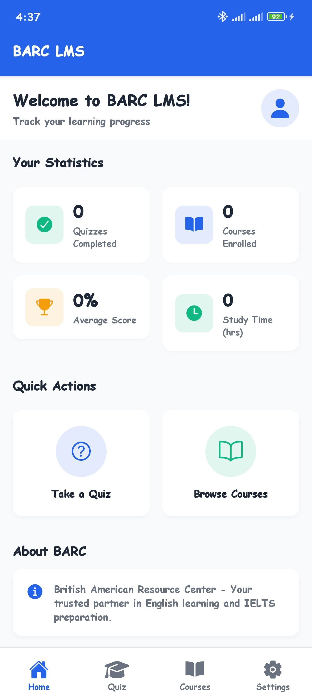
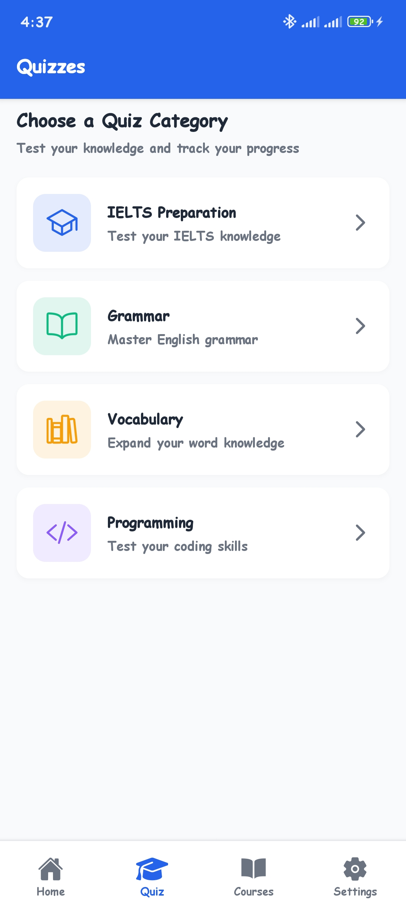
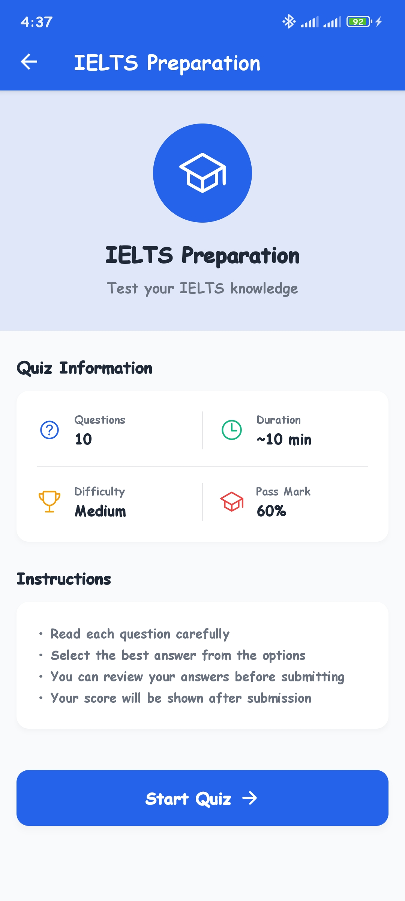
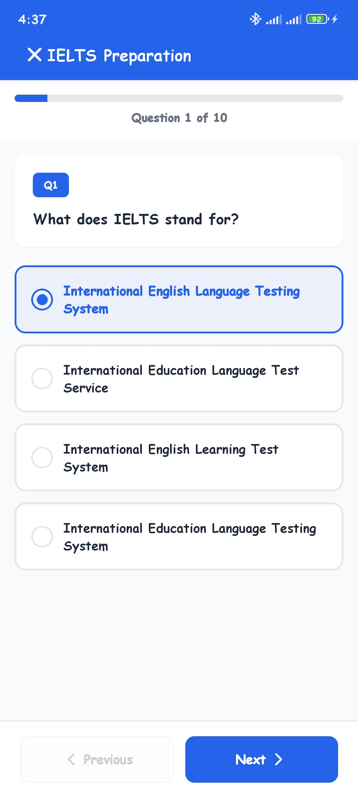
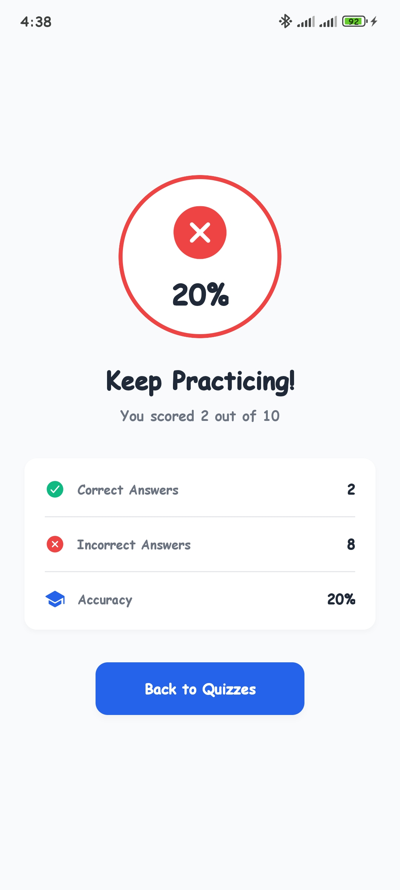
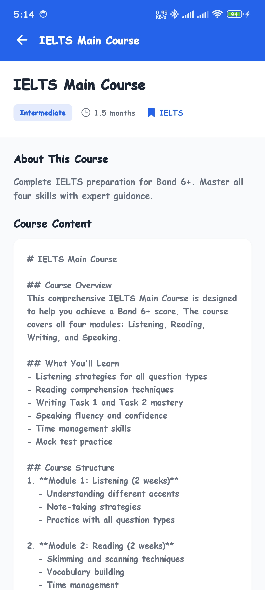
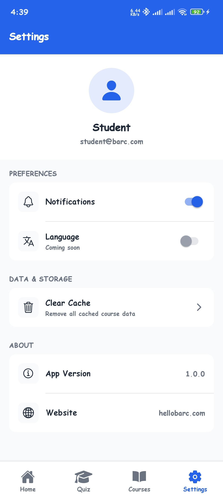

# BARC LMS - Learning Management System Mobile App

A comprehensive mobile Learning Management System (LMS) built for the British American Resource Center (BARC). This app provides students with an engaging platform for taking quizzes, accessing courses, and tracking their learning progress.

  

### App Screenshots











## 🎯 Features

### 📱 Bottom Tab Navigation

- **Home**: Dashboard with learning statistics and quick actions
- **Quiz**: Multiple quiz categories with MCQ questions
- **Courses**: Browse and access educational content
- **Settings**: App preferences and configuration

### 📝 Quiz Module

- **4 Quiz Categories**: IELTS Preparation, Grammar, Vocabulary, Programming
- **40 Total Questions**: 10 questions per category
- **Progress Tracking**: Real-time progress indicator (Question X of Y)
- **Score Display**: Detailed results with percentage and breakdown
- **State Persistence**: Redux-managed quiz state

### 📚 Courses Module (Offline-First)

- **6 Comprehensive Courses**: IELTS, Business English, Grammar, and more
- **Offline Support**:
  - Automatic caching with AsyncStorage
  - Course list and details available offline
  - Network status detection
  - Offline mode banner
- **Pull-to-Refresh**: Update course content
- **Detailed Course View**: Full course content with metadata

### 🏠 Home Dashboard

- **Learning Statistics**:
  - Quizzes completed counter
  - Courses enrolled count
  - Average score percentage
  - Total study time tracker
- **Quick Actions**: Fast navigation to Quiz and Courses
- **About Section**: BARC information

### ⚙️ Settings

- Notifications toggle
- Language (coming soon)
- Clear cache functionality
- App version and info

## 🛠️ Tech Stack

### Core

- **Expo SDK 54.0.13** - React Native development framework
- **React Native 0.81.4** - Cross-platform mobile development
- **TypeScript 5.9.2** - Type-safe JavaScript

### Navigation

- **@react-navigation/native** - Navigation framework
- **@react-navigation/bottom-tabs** - Tab navigation
- **@react-navigation/native-stack** - Stack navigation
- **expo-router** - File-based routing

### State Management

- **@reduxjs/toolkit** - Modern Redux state management
- **react-redux** - React bindings for Redux

### Storage & Network

- **@react-native-async-storage/async-storage** - Offline data persistence
- **@react-native-community/netinfo** - Network status detection

### UI & Icons

- **@expo/vector-icons** - Icon library (Ionicons)
- **react-native-safe-area-context** - Safe area handling

## 📁 Project Structure

```
frontend/
├── app/                          # Expo Router file-based routing
│   ├── (tabs)/                   # Bottom tab navigation
│   │   ├── _layout.tsx          # Tab navigator configuration
│   │   ├── index.tsx            # Home screen
│   │   ├── quiz.tsx             # Quiz categories screen
│   │   ├── courses.tsx          # Courses list screen
│   │   └── settings.tsx         # Settings screen
│   ├── quiz/
│   │   ├── [category].tsx       # Dynamic quiz category screen
│   │   └── test.tsx             # Quiz test screen
│   ├── courses/
│   │   └── [id].tsx             # Dynamic course details screen
│   └── _layout.tsx              # Root layout with Redux Provider
│
├── src/                          # Feature-based architecture
│   ├── features/
│   │   ├── home/
│   │   │   ├── components/      # Home components
│   │   │   └── store/           # Home Redux slice
│   │   ├── quiz/
│   │   │   ├── components/      # Quiz components
│   │   │   ├── data/            # Quiz mock data (40 questions)
│   │   │   └── store/           # Quiz Redux slice
│   │   └── courses/
│   │       ├── components/      # Course components
│   │       ├── data/            # Courses mock data (6 courses)
│   │       ├── services/        # Offline caching service
│   │       └── store/           # Courses Redux slice
│   ├── shared/
│   │   ├── components/          # Shared UI components
│   │   └── theme/               # Colors and styling
│   └── store/
│       └── index.ts             # Redux store configuration
│
├── assets/                       # Images and static files
└── package.json                 # Dependencies
```

## 🚀 Getting Started

### Prerequisites

- Node.js (v18 or higher)
- npm or yarn
- Expo CLI (`npm install -g expo-cli`)
- Expo Go app on your mobile device (iOS/Android)

### Installation

1. **Install dependencies**
   ```bash
   yarn install
   # or
   npm install
   ```
   **Start the development server**
   ```bash
   yarn start
   # or
   npx expo start
   ```
2. **Run on device/simulator**
   - Scan the QR code with Expo Go (Android) or Camera app (iOS)
   - Press `a` for Android emulator
   - Press `i` for iOS simulator
   - Press `w` for web browser

## 📱 Available Screens

### Main Screens

- **/** - Home dashboard with statistics
- **/quiz** - Quiz categories list
- **/courses** - Courses list with offline support
- **/settings** - App settings

### Dynamic Screens

- **/quiz/[category]** - Quiz category details (ielts, grammar, vocabulary, programming)
- **/quiz/test** - Active quiz test screen
- **/courses/[id]** - Course details (1-6)

## 💾 Offline Functionality

The app implements a robust offline-first approach:

1. **Automatic Caching**: Course data is automatically cached on first load
2. **Network Detection**: Real-time network status monitoring
3. **Offline Banner**: Visual indicator when offline
4. **Cached Content**: Previously loaded courses accessible without internet
5. **Cache Management**: Clear cache option in settings

### How It Works

```typescript
// Courses are cached in AsyncStorage
const COURSES_CACHE_KEY = "@lms_courses_cache";
const COURSE_DETAILS_PREFIX = "@lms_course_details_";

// Network status is monitored
NetInfo.fetch().then((state) => {
  if (state.isConnected) {
    // Load from API
  } else {
    // Load from cache
  }
});
```

## 🎨 Design System

### Color Palette (BARC-Inspired)

```typescript
colors = {
  primary: "#2563EB", // Blue
  secondary: "#10B981", // Green
  background: "#F9FAFB", // Light gray
  card: "#FFFFFF", // White
  textPrimary: "#1F2937", // Dark gray
  textSecondary: "#6B7280", // Medium gray
  success: "#10B981", // Green
  error: "#EF4444", // Red
  warning: "#F59E0B", // Orange
};
```

## 📊 Mock Data

### Quiz Data

- **40 questions** across 4 categories
- Topics: IELTS, Grammar, Vocabulary, Programming
- Format: Multiple-choice with 4 options each
- Location: `src/features/quiz/data/quizData.ts`

### Course Data

- **6 courses** covering various topics
- Includes: Title, description, image, duration, level, category, full content
- Location: `src/features/courses/data/coursesData.ts`

## 🧪 Development

### Running in Development Mode

```bash
yarn start
```

### Type Checking

```bash
yarn tsc --noEmit
```

### Linting

```bash
yarn lint
```

## 📝 Notes

- **No Authentication**: This is a demo assessment app without authentication
- **Mock Data**: All data is static and stored locally
- **Offline-First**: Courses module fully supports offline usage
- **State Management**: Redux Toolkit for global state
- **Type Safety**: Full TypeScript support

## 🎓 About BARC

British American Resource Center (BARC) is a leading English language learning institution specializing in IELTS preparation and comprehensive English courses. This LMS app provides students with:

- Interactive quiz system for self-assessment
- Comprehensive course materials
- Progress tracking and statistics
- Offline learning capabilities

## 📄 License

This is an assessment project for the British American Resource Center.

## 🤝 Contributing

This is an assessment project. For any questions or issues, please contact the development team.

---

**Built with ❤️ using Expo + React Native**
